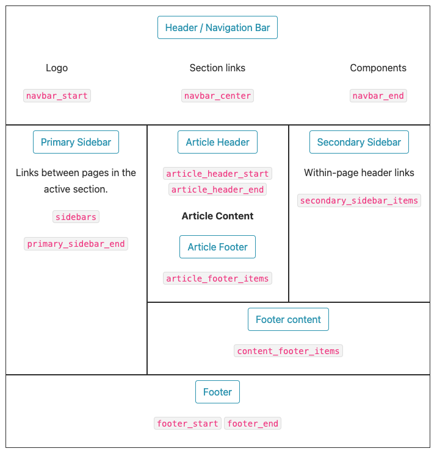
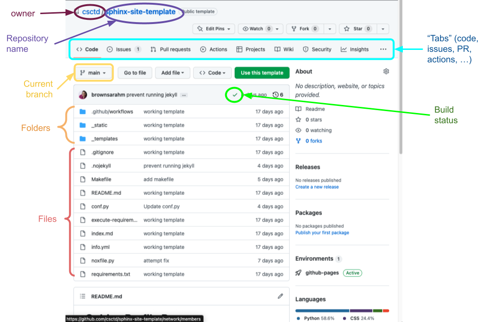
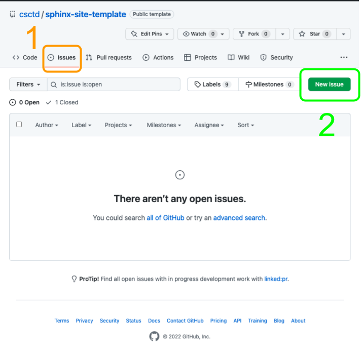

# Admonition

```{warning}
admonitions require a title, so factor that into your choice
```

```{note}
this and the warning above are also admonitions, but not `:class: slide` so they are always here
```


```{admonition} Py Data Theme variables
:class: slide


```


```{admonition} What is in a repo
:class: slide


```

```{admonition} Making an Issue
:class: slide


```
